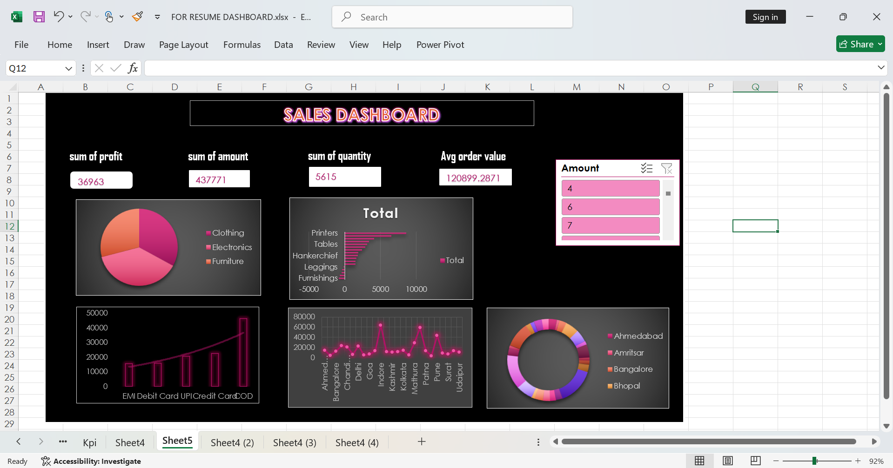
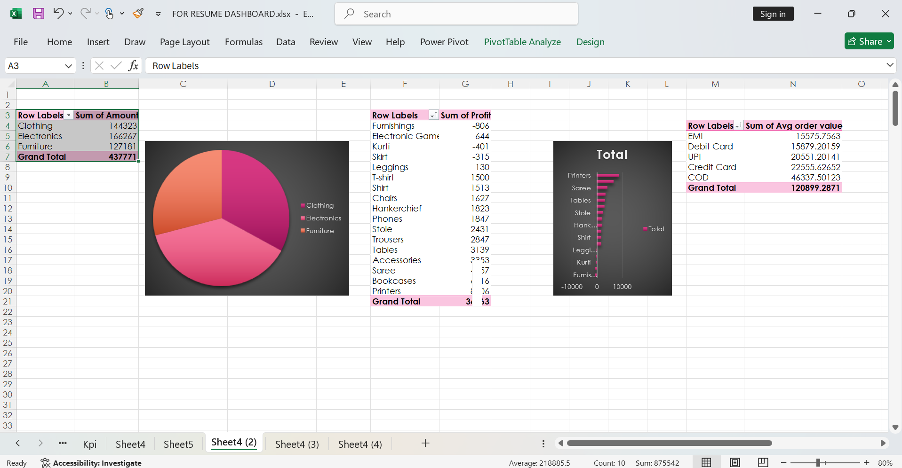

# # 📊 Dashboard in Excel

Welcome to the **Dashboard Project** — a sleek and interactive Excel dashboard designed to visually showcase your **skills**, **experience**, and **achievements**. Perfect for resumes, portfolios, or interview presentations! 💼✨

---

## 📸 Dashboard Preview

Here are snapshots of the Excel dashboard:

### 🔹 Overview Page

### 🔹 Skills & Experience Breakdown

---

## 💡 Features

| Feature | Description |
|--------|-------------|
| 📊 Interactive Dashboard | Professionally designed visuals with charts and summaries |
| 🔍 Easy Navigation | Structured with separate sheets for data and visuals |
| 📈 Data Insights | Use of PivotTables, Charts, and Conditional Formatting |
| 🖌 Customizable | Replace data with your own resume info to personalize it |

---

## 🧰 Tools Used

- ✅ Microsoft Excel
- ✅ PivotTables
- ✅ Bar & Pie Charts
- ✅ Conditional Formatting

---

## 🧾 File Included

| File Name                  | Description                                 |
|---------------------------|---------------------------------------------|
| `FOR_RESUME_DASHBOARD.xlsx` | Excel file with interactive resume dashboard |
| `1.png`, `2.png`            | Screenshots of the dashboard for preview    |

---

## 🚀 How to Use

1. Download or clone this repository.
2. Open `FOR_RESUME_DASHBOARD.xlsx` in **Microsoft Excel** (2016 or later recommended).
3. Browse through the sheets:
   - **Raw Data**: Contains source information.
   - **Dashboard**: View visual insights.
4. Customize with your own data if needed.

---

## 👤 Author

**Vaishnavi Bawne**  
📍 India  
📧 *https://www.linkedin.com/in/vaishnavi-bawane-118b04370/*

---

## 💬 Feedback

If you found this helpful:
- ⭐ Star this repo
- 🍴 Fork it and create your own version
- 💬 Open issues for suggestions

---

## 📜 License

This project is for **personal and educational** use.  
You're welcome to reuse or modify it to suit your own resume style! 🎯

---

> Thank you for checking out the project! 🌟  
